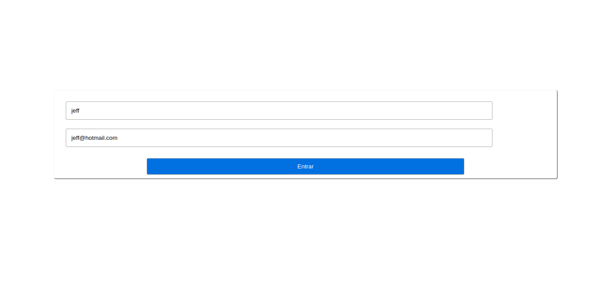
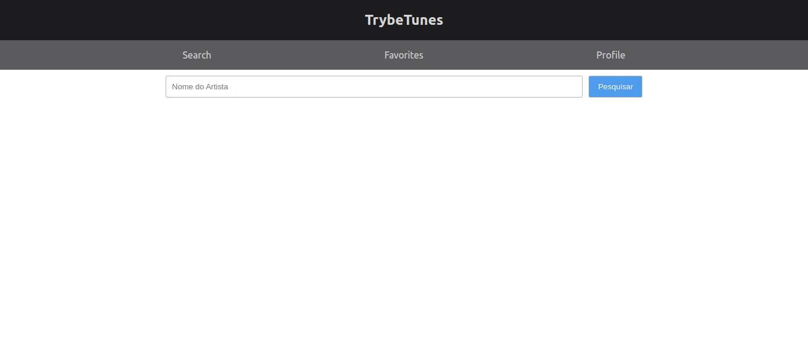
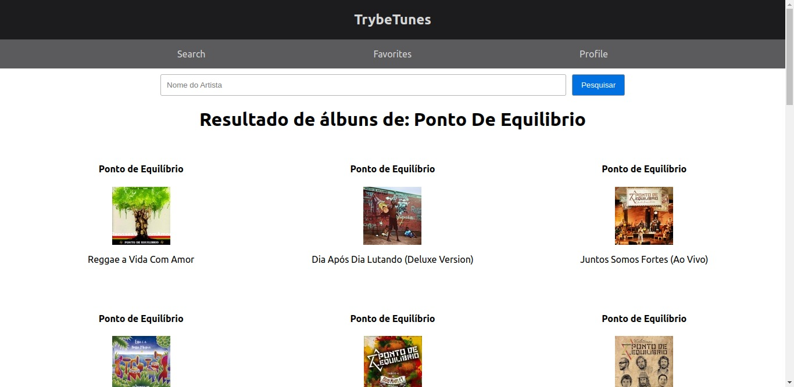
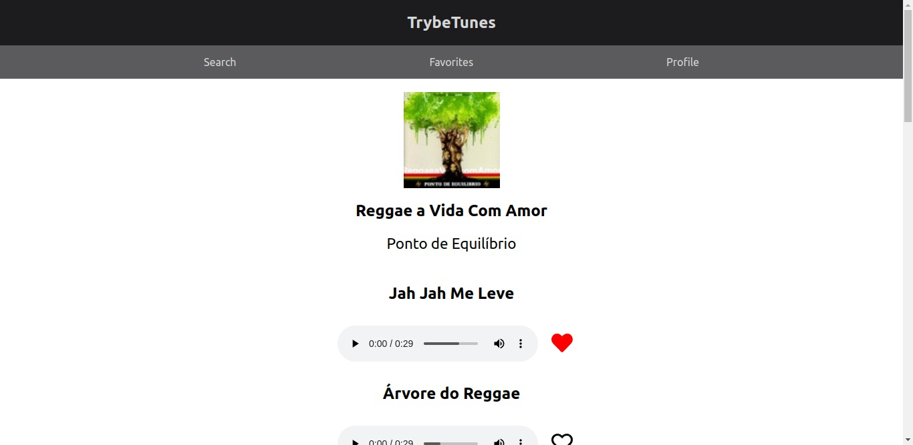
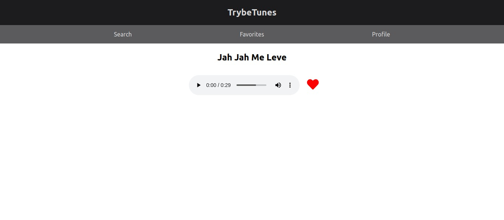

# TrybeTunes 

The idea of this project was to create, using ReactJS, an application that uses the iTunes API, allowing the user to search for his favorite artists and listen to a preview of the songs of a certain album.

In this project we had to use localStorage to store the songs favorited by the user, and when he goes back to the page the songs should be retrieved.

# Technologies Used

For this project the following technologies were used:

- [JavaScript](https://developer.mozilla.org/pt-BR/docs/Web/JavaScript)
- [ReactJS](https://pt-br.reactjs.org/)
- [Docker](https://www.docker.com/)

 

## Login

 

## Home

 

## Home with artist albums

 

## Album page

 

## Favorites page

 

# How to Use:

1. Clone the repository

  ~~~bash
  git clone git@github.com:JeffThierch/TrybeTunes.git
  ~~~

2. In the root of the project change the .env_example file to .env

3. (Optional) - Change the environment variables.

4. In the root of project run the commands:

  ~~~bash
  docker-compose up --build
  ~~~

5. If everything is configured correctly, after the build process you can simply access the application.
